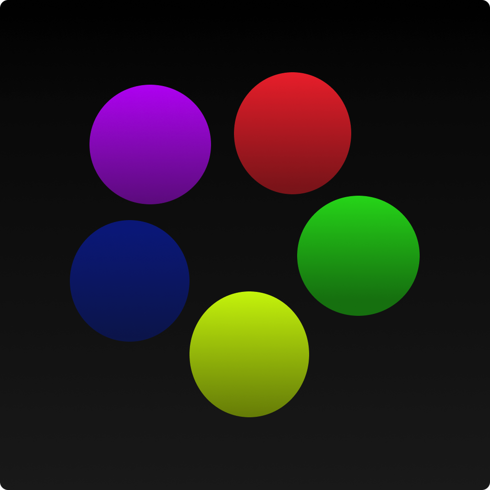

# Atoms



### Game on NestEngine

This mini game is written on the NestEngine. It supports playing over a local network. Enjoy the game!

### Windows
Build with CMake:
``` sh
git clone https://github.com/bogdanmikh/Nest.git
mkdir build && cd build
cmake -G "Visual Studio 16 2019" ..
start Atoms.sln
```

### Linux or Macos
Build with CMake:
``` sh
git clone https://github.com/bogdanmikh/Nest.git
mkdir build && cd build
cmake ..
make Atoms
```