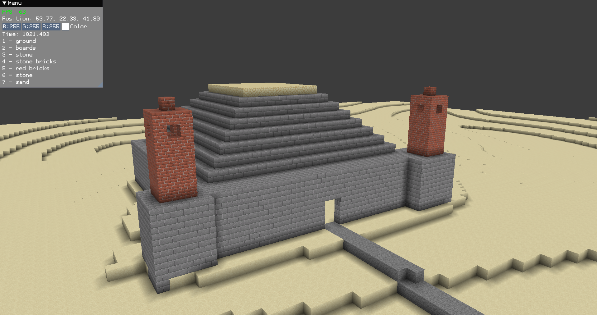

# NestCraft

### Game on NestEngine 

This mini game is written on the NestEngine

[//]: # (![Alt text]&#40;Screenshot.png "Screenshot"&#41;)


### Windows
Build with CMake:
``` sh
git clone https://github.com/bogdanmikh/Nest.git
mkdir build && cd build
cmake -G "Visual Studio 16 2019" ..
start NestCraft.sln
```

### Linux or MacOS
Build with CMake:
``` sh
git clone https://github.com/bogdanmikh/Nest.git
mkdir build && cd build
cmake ..
make NestCraft
```