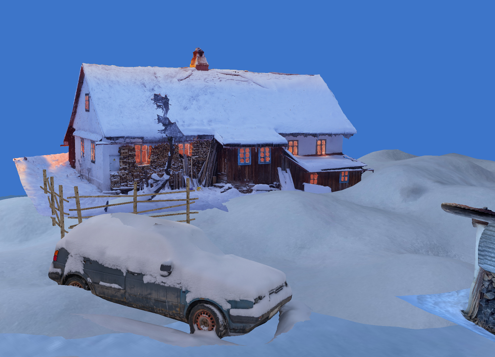
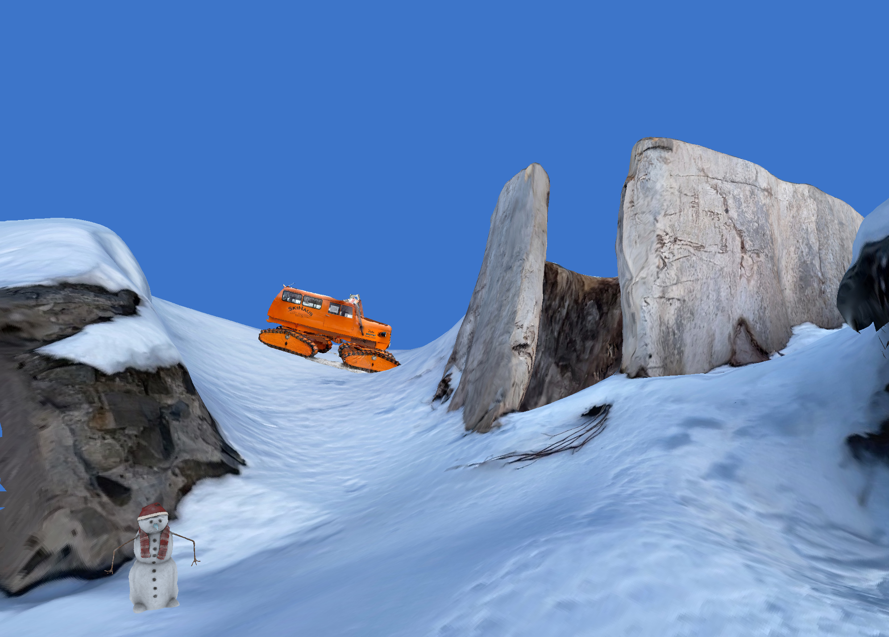

# Snow Scene

### Scene on NestEngine 

This scene with 3d models




### Windows
Build with CMake:
``` sh
git clone https://github.com/bogdanmikh/Nest.git
mkdir build && cd build
cmake -G "Visual Studio 16 2019" ..
start SnowScene.sln
```

### Linux or MacOS
Build with CMake:
``` sh
git clone https://github.com/bogdanmikh/Nest.git
mkdir build && cd build
cmake ..
make SnowScene
```